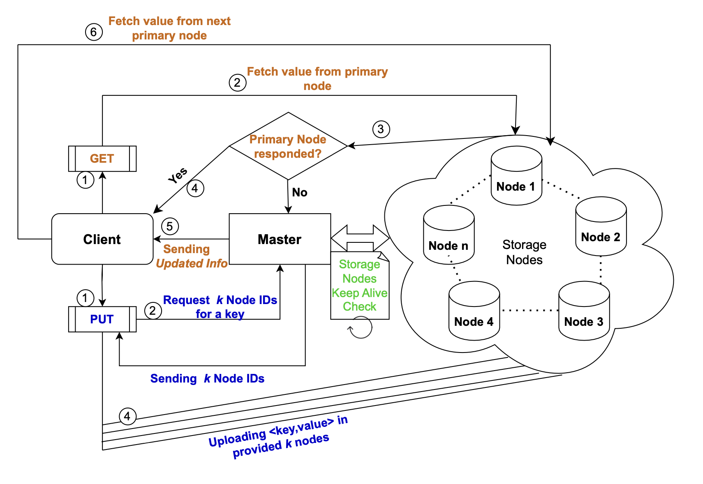
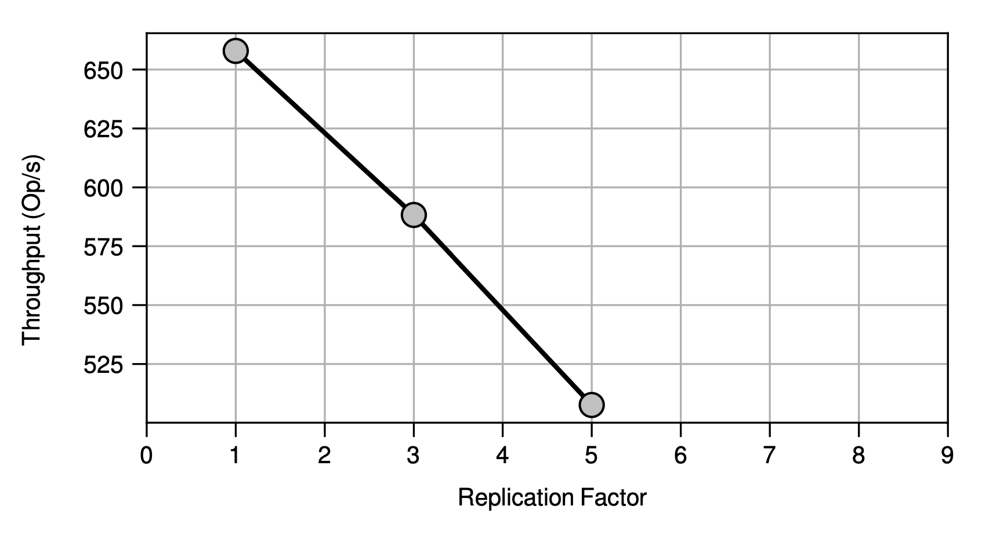

# **Distributed Key-Value Store**

## 1. **Introduction**

In this project, we will implement distributed key-value store system, by network calls for simulating the shopping processes.
KVStore is a centralized manager to multiple data nodes.
For the clients, the driver application, will perform gets and sets to key/value pairs while we manually take storage nodes offline to ensure that the service can recover from node failure.

### **System Components**

1. **KV Store**
   1. **Centralized manager**: One user-space process will handle all the control path decisions of the key-value store. The manager's tasks include, but are not limited to:
      1. Membership management
      2. Load balancing of clients across replica nodes
      3. Index management. E.g., you could (but not required) allow clients first contact centralized manager on initialization to figure out the data nodes where they should send their requests.

   2. **Storage/Data nodes**: N user-space processes will act as the storage nodes in the key-value store.
They will store in-memory and provide the key-value pairs, those they are responsible for.
These processes represent the actual key-value store.

2. **Driver application**: 
In a typical interaction, the application
	1. reads the latest version of the object
	2. mutates it, and
	3. stores it back.

3. **Client library**: The driver applications should use a simple programming interface, in order to interact with the key-value store. The base API includes;
   1. `init()`: initialize the client session with the manager and other control pathoperations.
   2. `put(key, value)`
   3. `get(key)`
   4. `finalize()`: control path cleanup operation.

For each request, the maximal key size is `20 bytes`, and the maximal value size is `1 KB`.

## 2. **Project Details**

### **Design Principles**

1. **Data Partitioning**

   KVStore aims to be a highly scalable key value store, thus storing all the data in a single node will not work. Ideally, the system should be able to serve an increasing number of client requests in proportion to
hardware resources we provision (number of data nodes).
Data partitioning schemes divide the responsibility of managing data elements across the data nodes.
For this section, you will design and implement:
   1. A data partitioning scheme to partition incoming data across data nodes.
   2. Data insert/lookup algorithm/protocol for the selected partitioning scheme in the context of your system design.
   3. Discuss pros and cons of your design.

2. **Data Replication**

   KVStore maintains K number of data replicas for any stored object.
Replication increases fault tolerance of the system and under certain consistency schemes increase the system availability.
In this section you will design and implement:
	1. A data replication mechanism for KV Store.
	2. Clearly describe the replication protocol/set of events during data insert/lookup.
	3. How does your replication mechanism works alongside with the proposed data partitioning technique? e.g. node with the primary replica fails.

3. **Data Consistency**

   Data consistency scheme plays a major role in defining the availability of any data store.
Immediate replication is ok.
For instance, your consistency protocol may act as follows:
   1. Inserted objects get stored on K (replication parameter) nodes within a bounded time.
   2. Read operations are guaranteed to receive the latest version of the requested object.

## 3. **Implementation**

Most of the code defined in `src` directory. Feel free to make any necessary modifications to the classes and function parameters defined inside the given `{.hpp, .cpp}`. You can also modify the Makefile. You can add files, just make sure to update the build scripts accordingly.
* gtstore.hpp
* manager.cpp
* storage.cpp
* client.cpp
* test_app.cpp
* Makefile
* run.sh
* RPC related meta-files if any

**Implementation details**

* Code implementation in C/C++.
* Each node in the distributed system using a separate process running on a single machine.
* Avoid using shared memory or file system to communicate between nodes. It has to be a network call, so KVStore can work when deployed across many machines.
* Remote Procedure Calls (RPC) are used for the communication between nodes. Look at the [Google gRPC](https://grpc.io/docs/tutorials/basic/c.html) for more details.
<!-- Note that if you go this route, you will likely benefit only from the stubs for the message buffer management (i.e.,sending/receiving the key value pairs), but you will still need to orchestrate the distributed interactions among the client(s) and server(s) by yourself. -->


# **Design**
Team Members: 

Himanshu Goyal

Mohit Gupta

##  **Key-Value Store Overview**
Our team designed a fault-tolerant replicated GT Store, a distributed system that stores
key-value pairs. To build this system, we utilized Google’s Remote Procedure Call (gRPC)
framework, which provides a way for different components of the system to communicate
with each other efficiently.
Our primary goal during the design process was to ensure that the system could handle
a high volume of requests and provide reliable access to data. To achieve this, we focused on
three critical factors: scalability, availability, and reliability. We believe that our resulting
system can handle large amounts of data traffic while remaining operational in the face of
failures and providing accurate and consistent data to users.

## **System Components**

### **Centralised Manager**
In our design, the centralized manager acts as an orchestrator. The manager process is
initiated first with two parameters - the number of storage nodes and the replication factor.
Based on the provided parameters, the manager forks the required number of storage node
processes and sets up a communication path with each.
The manager process exposes two RPC interfaces for communication. One is for the
client, and the other is for the storage nodes. It functions as both a client and server process
simultaneously. When a GT store client requires control information, it connects to the
manager process and requests it. Therefore, the manager process acts as a server for the
GT Store client. On the other hand, to maintain the active state of all the storage nodes,
the manager process sends keep-alive ping messages at a periodic intervals. In this case, the
manager process acts as a client.

1. __KeepAliveCheck():__ To ensure the continuous operational state of the storage cluster
nodes, the manager periodically sends a keep-alive ping message to all of the nodes
and updates the relevant information based on the responses received. The manager
always handles GET and PUT requests from the client in accordance with this updated
information.

2. __Provide K Nodes(key):__ Whenever a client wants to perform a PUT operation, it
connects to the manager process to obtain control information. Based on the health
status of the storage cluster, the manager process determines the required number of
storage node IDs using our deterministic data partitioning scheme (described later) and
returns the list to the client. The client then connects to the specified storage nodes
and uploads the data.

3. __ProvideNextPrimaryID(key):__ In our design, when fulfilling a GET request, the client first attempts to connect to the primary replica. However, if the connection fails due to a primary replica failure, the client calls this API as a protective measure to obtain updated information about the particular key. The manager process serves the request by providing the new primary storage node responsible for the key.

### **Storage Nodes**
Our storage node process always functions as a server process, providing GET and PUT
Remote Procedure Call (RPC) interfaces to the GT store client. The storage node initializes
a hash map data structure and uses it to store key-value pairs. We chose the hash map data
structure as it provides constant time lookup, i.e., O(1).
In our design, when storing or fetching a key-value pair, the client connects directly to
the storage nodes based on the control information provided by the manager. Hence, the
manager process never acts as an intermediary for any data retrieval or storage operations.
It resulted in better efficiency of the overall system.

1. __GetReply(key,Value):__ The storage node searches for the requested key in its hash-
map data structure. If the key is found in the hash map, the storage node returns the
corresponding value. If the key is not found in the hash map, the storage node returns
a lookup failure code.

2. __PutReply(key,Value):__ If the storage node encounters the key for the first time,
it adds a key-value entry to the local storage. Otherwise, if the key already exists in
the local storage, the storage node updates the value of the existing key with the new
value.

### **Client API Calls**
Our design assumes that the client process is a stateless process. Therefore, whenever the
client process is launched, it connects to the manager process to obtain the necessary infor-
mation required to communicate with the storage nodes. The overall working of the client
process for GET and PUT requests can be understood through the control flow shown in
Fig. 1.

<p align="center">

</p>
<p align="center"><i>Figure 1: End-to-End workflow of GET and PUT requests from the Client</i></p>
<br /><br />

1. __Init():__ The client process initially makes an RPC call to the manager, assuming it knows the manager's IP address. Consequently, the manager sends the necessary metadata information regarding the cluster, i.e., Number of Storage Nodes, Replication factor, etc., to the client as an RPC response.

2. __PutRequest(key,Value):__ The client makes an RPC call via Provide K Nodes(key):
to the manager to obtain control information related to the appropriate k (replicated
factor) storage nodes. Upon receiving the requested information from the manager, the
client proceeds to independently establish connections with the corresponding storage
nodes and upload the <key,value> pair to each of storage node. The client uploads
the value simultaneously to storage nodes with the help of multi-threading. The client
interacts with the manager solely to obtain control information and subsequently inter-
acts directly with the storage nodes for the data path without involving the manager
again

3. __GetRequest(key):__ Using our deterministic hash algorithm, the client calculates
the primary node for the given key locally and attempts to retrieve its corresponding
value directly from it via RPC call. If the value is successfully retrieved, it exists.
However, if the connection fails, indicating that the intended primary node has failed,
the client contacts the manager via ProvideNextPrimaryID(key) and requests updated
information on the next primary node. The client then retrieves the value for the
requested key from the new primary node and returns it to the application.

### **Design Principles**

#### **Data Partioning**
__Hashing Algorithm(key)__: We design a deterministic and simple hashing algorithm.
Given a key value, we calculate the sum of ASCII values of the characters present in the
provided key and finally do Sum % Number of Storage Nodes. It returns a unique value
between 0-Number of Storage Nodes-1. We consider the returned index to be the primary
replica for handling the given key. Given a random set of keys, we believe this hashing would
help distribute the data traffic nearly equally on all the storage nodes. Since both the client
and the manager use this algorithm to find the primary node id, we decided to make it
deterministic.

#### **Data Replication**
Based on the primary node index returned by the hashing algorithm, we replicate the data
on the k successive storage nodes, assuming the nodes are virtually aligned circularly. To
ensure that the data is replicated even in the event of intermediate node failures, the manager
process combines the information from the KeepAliveCheck() API and starts looking for K
storage nodes starting from the primary node index when serving the Provide K Nodes(key)
API. The constraint that there could be at most k − 1 failures in the system guarantees
that the data will be stored in at least one storage node using this approach. In case of the
primary replica failure, the operations workflow can be learned with the description provided
earlier in Sec. 2.3 and Fig. 1.

#### **Data Consistency**
For the PUT request, once the client learns the storage node IDs via the Provide K Nodes(key)
API, it uploads the data synchronously and waits until the storage nodes have confirmed that
they have applied the requested write. Consequently, the client does not proceed until it re-
ceives write acknowledgments from all the concerned storage nodes. We believe that the
advantages of synchronous writing are that the client is guaranteed to have an up-to-date
version of the data while performing the GET(key) request since the data is consistent across
all the storage nodes.


Overall, Synchronous writing ensures that the client receives an acknowledgment from all
the storage nodes, which implies that the data has been successfully written to all the nodes.
Therefore, the client is guaranteed to have an up-to-date version of the data. Additionally,
the synchronous nature of writing ensures that the data is consistent across all the storage
nodes. This is because, during the write operation, all the concerned storage nodes apply
the write operation in the same order, thereby ensuring that the data is consistent across all
the nodes


### **Performance**

#### **Throughput**
o measure the throughput of our designed GTStore system, a total of 200,000 opera-
tions were performed on 7 nodes, with 1, 3, and 5 as the replication factor. These operations
included a combination of 50% GET and 50% PUT operations. The performance of the
system is illustrated in Figure 2. Despite an increase in the number of replica nodes, we
did not observe a significant decrease in the throughput of the operations due to the effi-
ciency of our design when serving GET/PUT requests. For PUT requests, the client receives
control information regarding the replica nodes and then simultaneously uploads data using
multi-threading to all nodes. For GET requests, the client node can compute the primary
replica locally and connect directly to it to retrieve the data, eliminating the need for any
communication with the manager. We believe that the optimizations behind both operations
have made our system efficient and scalable.

<p align="center">

</p>
<p align="center"><i>Figure 2: Key  Value Store performance with variation in the number of replica nodes</i></p>
<br /><br />

#### **Key(s) distribution**
During performance testing of the GTStore system, we also analyzed key distribution over
the 7 nodes while using 1, 3, and 5 replicas. To ensure robust testing, we selected keys
using the random function rand() provided by the C library. Figure 3 shows that in all three
cases, the keys were distributed almost equally across all seven nodes. We believe that our
designed hashing algorithm for data partitioning is effective and guarantees efficient storage
space utilization across replica nodes.

<p align="center">

</p>
<p align="center"><i>Figure 3: Key distribution with respect to replication factor</i></p>
<br /><br />


### **Design Tradeoffs**
#### __Pros__
- The lightning-fast response property is favored in our designed GTStore system. When-
ever the client has a GET request, it can locally compute the responsible primary replica
in our design. Later, it directly connects to the primary replica and fetches the corre-
sponding value if it exists, without any interaction with the manager node. It results in
saving the cost of an RPC call. The manager service only provides control information
initially and is never involved in actual data fetch.
- Upon receiving control information from the manager for a PUT request, the client
uploads data to the replica node in parallel using multi-threading, resulting in less
overall time compared to a sequential connection with the replica nodes.
- By combining synchronous data consistency and the constraint of having at most k − 1
replica nodes, our designed GTStore guarantees that at least one storage node for a
given key will always be found, and the client will be able to retrieve the value, making
it fault-tolerant.

#### __Cons__
- Our design won’t work consistently in the case when multiple clients interact with the
GTStore service simultaneously.
- Addition of a new storage node to the system won’t be easy as we follow a static data
partitioning scheme dependent on the initial storage nodes count.
- Append operation can corrupt the data in case of a node failure since we are always
replicating a key-value pair to k consecutive nodes starting from the primary replica
node; hence any intermediate failure will result in data loss.

```C
// Change the working directory
cd src

// To compile the project:
cmake .
make


// Now for running the tests
./test1.sh
./test2.sh


// First start the manager service
./manager -n (number of storage nodes) -k (replication factor)

// Running Specific PUT/GET request
./test_client --put key1 --val value1
./test_client --get key1
```

## Project Report
The overall design with test demo can be seen [here](./Project%20Report.pdf).